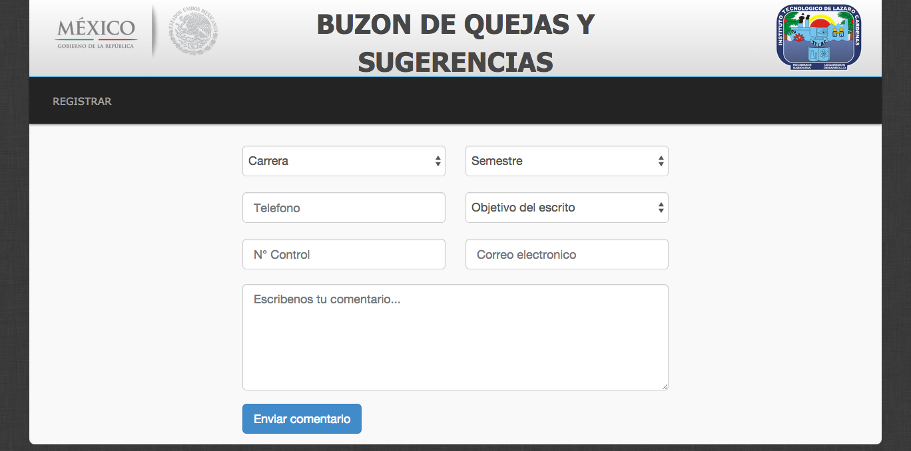
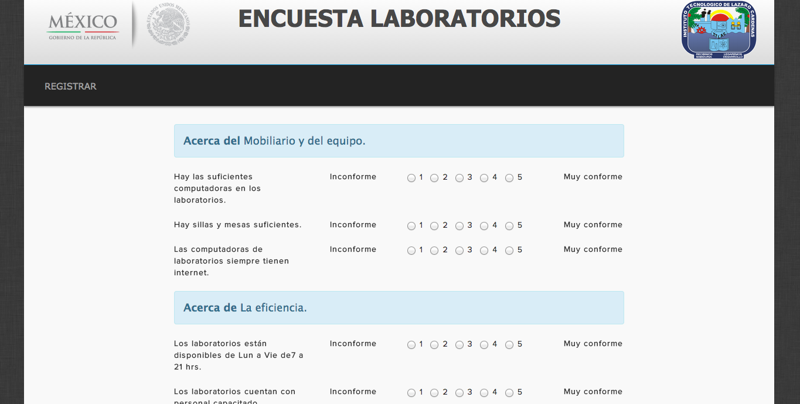
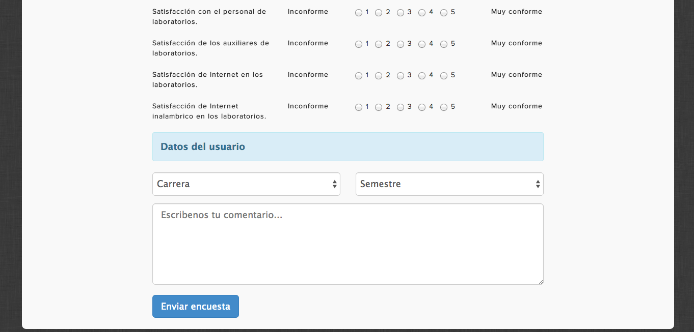

Servicios del laboratorio
=========================
Proyecto que implementa un buzon de quejas, un sistema de encuestas y un sistema de registro para alumnos del servicio social.
Esta aplicacion esta construida usando las librerias:
- [Bootstrap](http://getbootstrap.com/)
- [JQuery](http://jquery.com/)

